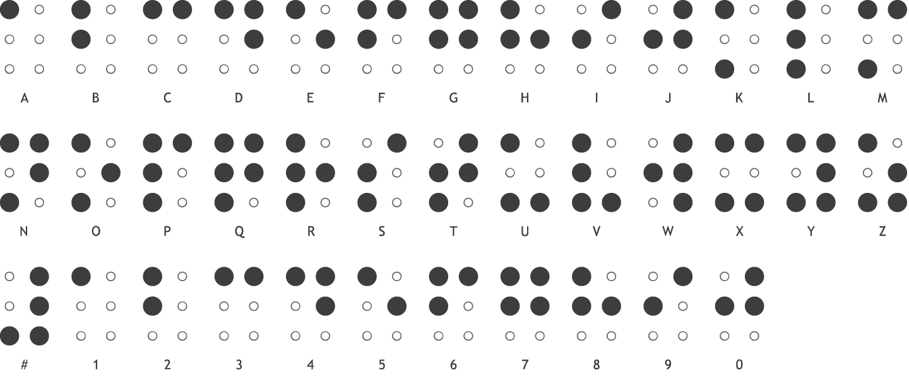
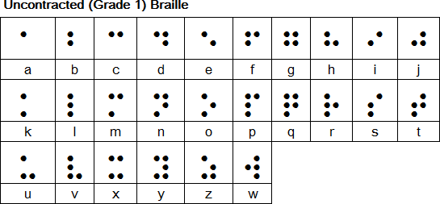
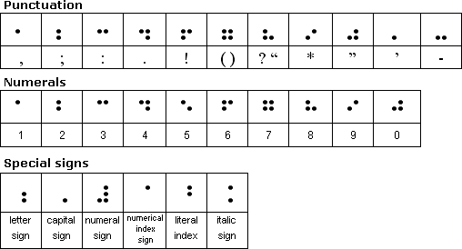
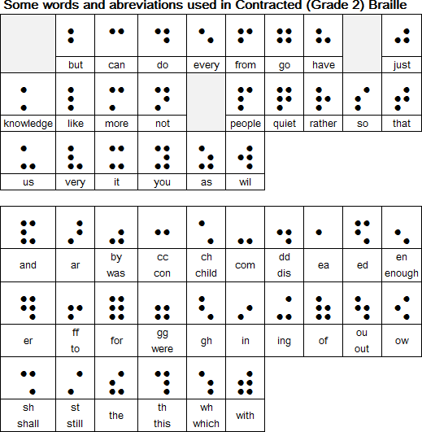

Braille Translation
======================================

We're going to build a program to translate ASCII text into Basic Braille.

# About Braille

Braille is writing system which enables blind and partially sighted people to read through touch. It was invented by Louis Braille (1809-1852), who became blind in a childhood accident and later became a teacher of the blind.

Braille consists of patterns of raised dots arranged in cells of up to six dots in a 3 x 2 configuration. Each cell represents a letter, numeral or punctuation mark. Some frequently used words and letter combinations also have their own single cell patterns. It was based on a tactile military code developed by Charles Barbier known as night writing or sonography.

Braille Alphabet and Braille Numbers (from: http://www.pharmabraille.com/pharmaceutical-braille/the-braille-alphabet/)

These braille dots are positioned like the figure six on a die, in a grid of two parallel vertical lines of three dots each. 

From the six dots that make up the basic grid, 64 different configurations can be created. These 64 braille characters can be seen below in the Unicode braille code chart. 

The Unicode block for 6 dot braille is U+2800 – U+283F.

(From: http://www.omniglot.com/writing/braille.htm)

There are a number of different versions of Braille:

Uncontracted or Grade 1

        Which consists of the 26 standard letters of the alphabet and punctuation.
        It is only used by people who are first starting to read Braille.
  

      
Contracted or Grade 2

        Which consists of the 26 standard letters of the alphabet, 
        punctuation and contractions. The contractions are employed
        to save space because a Braille page cannot fit as much text as a standard printed page. Books, signs in public places, menus, and most other Braille materials are written in Contracted Braille.
        

Grade 3

        Which is used mainly in personal letters, diaries, and notes,
        and also in literature to a limited extent. It is a kind of shorthand,
        with entire words shortened to a few letters.
        There is no official standard for this version of Braille.

Build a translator
===================

### Story 1

ASCII To Basic Braille

    As a user
    When I parse a text string
    I can output it as braille on the screen visibly
    
    Accept: Any visual representation will do.

### Story 2

Word Wrap

    As a user
    When I type in a long sentence
    It word wraps my braille on the screen

### Story 3

Contracted Braille

    As a user
    When I type in a word that is part of the contracted braille syntax
    The word is shortened to the contracted pattern

