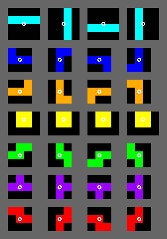

# Simple Tetris Clone

Tetris (Russian: Те́трис, pronounced [ˈtɛtrʲɪs]) is a tile-matching puzzle video game,
originally designed and programmed by Russian game designer Alexey Pajitnov. 

It was released on June 6, 1984, while he was working for the Dorodnicyn Computing
 Centre of the Academy of Science of the USSR in Moscow.
 
 He derived its name from the Greek numerical prefix tetra- 
 (all of the game's pieces contain four segments) and tennis, Pajitnov's favorite sport.

# Rules

 We're going to implement a cut down Tetris clone, following a reduced set of the Tetris Guidelines
 (the currentor specification that The Tetris Company enforces for making all new
 Tetris game products alike in form).

 Lovingly abridged from http://tetris.wikia.com/wiki/Tetris_Guideline

## Playfield

* Playfield is 10 cells wide and at least 22 cells tall.
* Rows above 20 are hidden or obstructed by the field frame

## Tetrominos 

All tetrominoes exist inside a bounding square and rotate about the center of this square
unless obstructed. 

Tetrominoes of width 3 (J, L, S, T, Z) are placed in the top two rows of the bounding square
and (for J, L, and T) with the flat side down. I is placed in the top middle row.

Ref: http://tetris.wikia.com/wiki/Tetromino

* Cyan I
* Yellow O
* Purple T
* Green S
* Red Z
* Blue J
* Orange L

All possible rotation states, rotating around the bounding box:

## Start Locations

* The I and O spawn in the middle columns
* The rest spawn in the left-middle columns
* The tetrominoes spawn horizontally and with their flat side pointed down

## Gameplay

* A Random block is drawn
* It is placed in the top two lines of the grid
* It `ticks` downwards as gravity is applied
* The user may move the piece left and right with their arrow keys
* The player may left and right `rotate` the pieces if they fit
* A block may not move into a space occupied by a previous block
* If gravity `ticks` when a block is obstructed, it sticks in place.
* Blocks spawn until the player is defeated.
* When a `tick` occures, any completed horizontal lines are cleared
* If a line is cleared, all contents shift downwards.
* Clearing and shifting occurrs until there is nothing left to clear

## Defeat

The player `tops out` when:

* A piece is spawned overlapping at least one block, 
* A piece locks completely above the visible portion of the playfield

# Approach and Hints

There are lots of discrete pieces that all join together to make "a tetris".

Think about discrete:

* Random generators
* Lists of blocks
* Block rotation in isolation of the game.
* The game loop (`ticks`)
* Collision detection with other blocks
* Input distinct from the game

# Randomiser Specification

The Random Generator generates a sequence of all seven one-sided tetrominoes
(I, J, L, O, S, T, Z) permuted randomly, as if they were drawn from a bag.

It deals all seven tetrominoes to the piece sequence before generating another bag.

It can produce a maximum of 12 tetrominoes between one I and the next I, 
and a run of S and Z tetrominoes is limited to a maximum of 4.